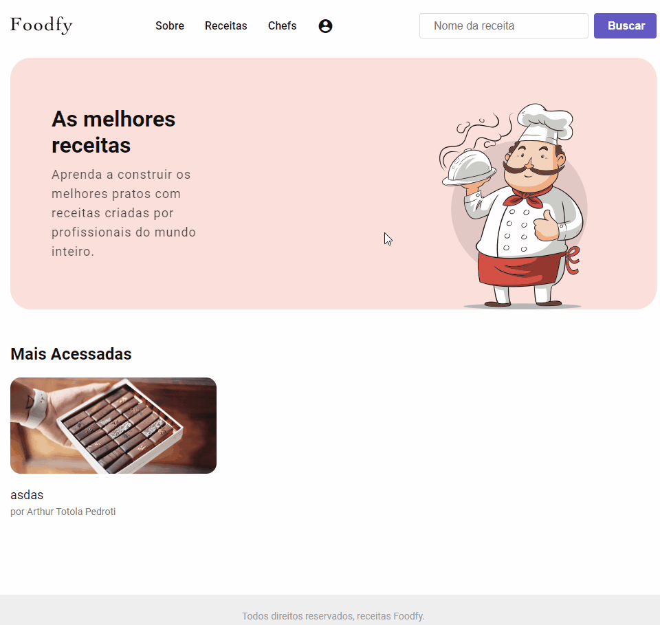

<h1 align="center" >
  GoMarketplace
</h1>
<h1 align="center">
    
</h1>

<h3 align="center" >
  A simple and beautiful recipes website
</h3>

<p align="center">
  
  
  
  <a href="https://github.com/ArthurPedroti/foodfy/commits/master">
    
  </a>
   <a href="https://github.com/ArthurPedroti/foodfy/issues">
    
  </a>
  
</p>
<p align="center">

  <a href="https://github.com/ArthurPedroti" target="_blank">
    
  </a>
  <a href="https://github.com/ArthurPedroti" target="_blank" >
    
  </a>
  <a href="https://www.linkedin.com/in/arthurpedroti/" target="_blank" >
    
  </a>
  <a href="mailto:arthurpedroti@gmail.com" target="_blank" >
    
  </a>
  <a href="https://api.whatsapp.com/send?phone=5519991830454"
        target="_blank" >
    
  </a>

</p>

<p align="center">
  <a href="#Description">Description</a>&nbsp;&nbsp;&nbsp;|&nbsp;&nbsp;&nbsp;
  <a href="#computer-languages">Languages</a>&nbsp;&nbsp;&nbsp;|&nbsp;&nbsp;&nbsp;
  <a href="#books-technologies">Technologies</a>&nbsp;&nbsp;&nbsp;|&nbsp;&nbsp;&nbsp;
  <a href="#install">Install</a>&nbsp;&nbsp;&nbsp;|&nbsp;&nbsp;&nbsp;
  <a href="#books-usage">Usage</a>&nbsp;&nbsp;&nbsp;|&nbsp;&nbsp;&nbsp;
  <a href="#memo-license">License</a>
</p>

## Description

This project is a recipe site, where you can register chefs and recipes, and you can relate each chef with all the recipes. We can manage the users also, to manage the recipes they created, the admin can manage the users, and can create and edit the chefs, and the other users can create and edit the recipes they created. Also have a login system, where when the admin creates a new user, send a email to this user with a password, and this user can login and recovery/change their password. All the chefs and recipes are shown at the site with all the ingredients, image galleries, and how to prepare the recipe.

## :computer: Languages

- **HTML**
- **CSS**
- **Javascript**

## :books: Technologies

- **cors**: ^2.8.5
- **dotenv**: ^8.2.0
- **express**: ^4.17.1
- **fs**: 0.0.1-security
- **method-override**: ^3.0.0
- **nunjucks**: ^3.2.1

### devDependencies

- **browser-sync**: ^2.26.7
- **nodemon**: ^2.0.2
- **npm-run-all**: ^4.1.5

## Install

- Edit the file ".env" with your database information;
- Use the file "database.sql" to run the queries and create the database.
- Run "npm install" to install all the dependencies;
- And "npm run dev" to start the server in development mode.

## Usage

```sh
npm run dev
```

## Author

👤 **Arthur Pedroti**

* Github: [@ArthurPedroti](https://github.com/ArthurPedroti)
* Linkedin: [@ArthurPedroti](https://www.linkedin.com/in/arthurpedroti)

## 🤝 Contributing

Contributions, issues and feature requests are welcome!<br />Feel free to check [issues page](https://github.com/ArthurPedroit/GoMarketplace/issues). You can also take a look at the [contributing guide](https://github.com/ArthurPedroit/GoMarketplace/blob/master/CONTRIBUTING.md).

## Show your support

Give a ⭐️ if this project helped you!

## 📝 License

Copyright © 2020 [Arthur Pedroti](https://github.com/ArthurPedroti).<br />
This project is [MIT](https://github.com/ArthurPedroit/GoMarketplace/blob/master/LICENSE) licensed.

---

Made by :blue_heart: by [Arthur Pedroti](https://github.com/ArthurPedroti)
